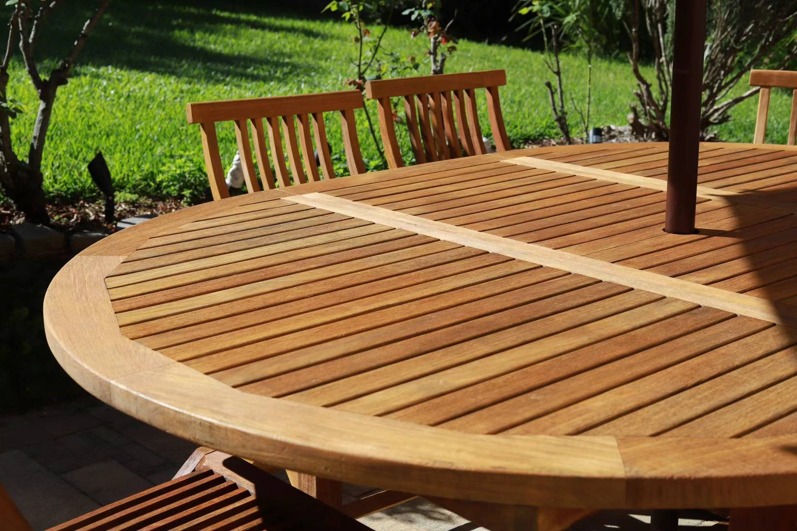

I bought this old Jeti outdoor dining set from facebook marketplace for $400. The brand new teak furniture are expensive, a similar brand new [6 seater](https://jati.com.au/product/camden-teak-extension-table/) can cost more than $5000 AUD. 

The set still has a pretty sturdy structure, just the surface has weather and grey out.

### Materials 

- Cabot deck cleaner 
- High pressure washer
- Boom
- [Teak sealer](https://www.greencorpmarine.com/product/justteak-teak-sealer-choice-of-2-shades/)
- [Teak brightener](https://www.greencorpmarine.com/product/justteak-teak-brightener-available-in-3-different-sizes/)

### Steps

1. Rinse the surface
2. Thin the deck cleaner with 1:4 ratio of water
3. Spray over the surface, let it sit for 15-30 mins. Don't let it dry out in summer.
4. High pressure washer the surface. You will immediately see the difference.
5. I also applied some teak brightener to see the effect. It does light up the surface but I think this is an optional step.
6. Repeat the above process if there's residue.
7. Wait til dry out
8. Sand surface with 120 grit paper.
9. Clean surface with a clean wipe.
10. Apply two coats of sealer. You can use whatever finish you like. I prefer clear oil. Test in a small area first to see if you are happy with how it turns out.

## Before

## High pressure washer

## Sanding

## Apply sealer

## Finish

