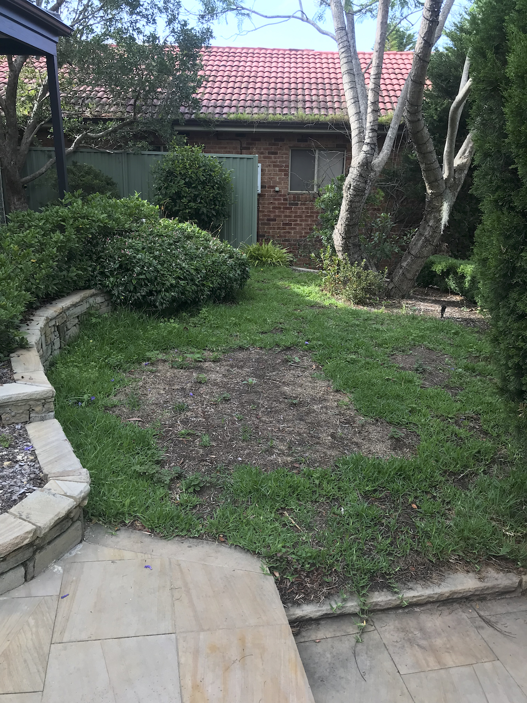
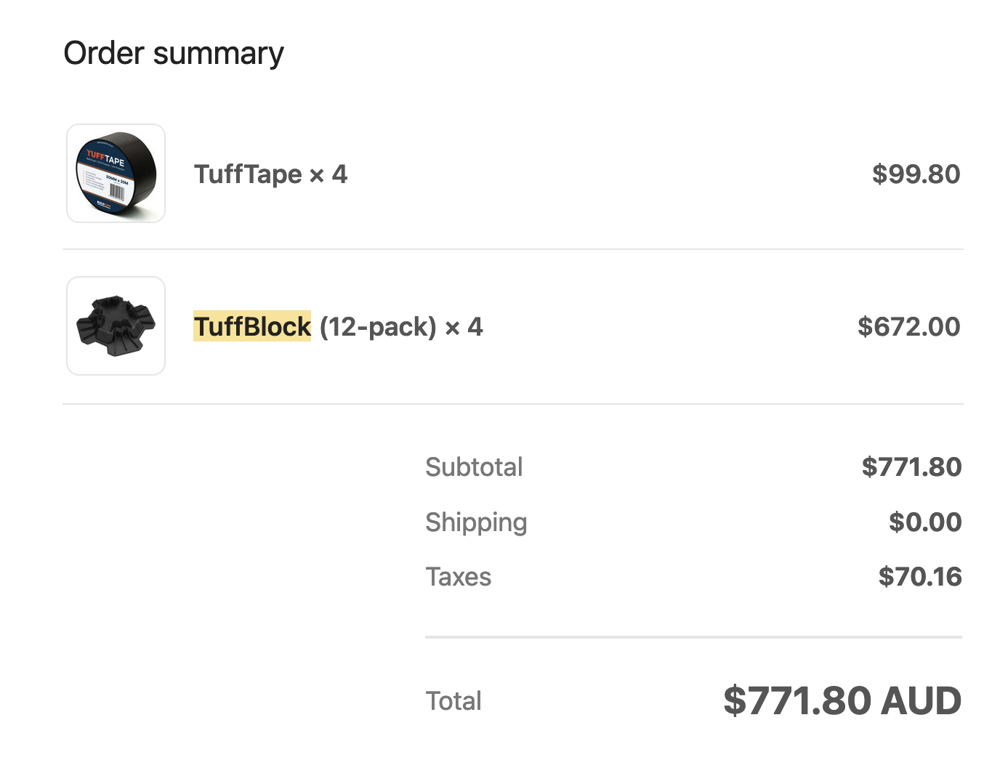

## Design

The original front yard was a lawn but poorly maintained. Due to incorrect material storage, a section in the middle of the lawn had died, resulting in very low utilization of this area.

Initially, we considered re-laying turf. But quickly we realized that due to the surrounding tree shade and insufficient sunlight in winter, maintaining a healthy lawn in this area would be challenging. Therefore, we considered creating a decking to improve this area. The patio could also serve as a welcoming area in front of the entrance, giving a cleaner and more spacious appearance

## Site prep

In March 2023. I started ripping off old lawn and used a tamper to level the ground. I must say, this task was truly exhausting. The turf with soil attached seemed light at first, but by the time I had filled a green bin, I could barely move it. After clearing the turf, I accurately measured the site dimensions and created a model in SketchUp to visualize the effect.

During the design phase, I realized this project had three main challenges:

  - The existing steps on both sides had a 100mm height difference, making it difficult to connect the horizontal surface of the platform with the two sides.
  - Edging the curved area of the existing flower bed.
  - The small gap between the platform and the soil layer, which complicated the implementation of the foundation plan.

## Materials

I estimated the materials to be

- 90*45mm H3 Treated pine 90LM
- Blackbutt 86*19mm 280LM
- Connectors

I ordered materials from [Abbey Timber](https://abbeytimber.com.au/)

And for footings, I used [Tuffblock instant footing](https://www.bunnings.com.au/tuffblock-300-x-300-x-90mm-instant-foundation-system-deck-support_p2410345) to save effort from post digging and disruption to the tree roots.

## A bit pause

After initially breaking ground and roughly setting the framework direction in March 2023, the project came to a halt. In July 2023, I returned to my home country for two months. After coming back to Sydney in September, I was constantly troubled by the issue of leveling the framework, and the work remained at a standstill. To be honest, as this was my first time tackling such a large project on my own, I felt stuck on how to proceed at certain points.

From late November, I began to push the project forward again, but progress was slow. Adjusting the slope took a lot of time and it was difficult to see significant results."

## Framing

The entire framework was laid out along the long edge with joists spaced 450mm apart from the center line, using Tuffblocks to adjust the height. Adjusting the height was quite time-consuming, and we used quite a few window packers for fine-tuning. Although this step was tedious and time-consuming, it directly affects the evenness of the finished surface, so it's crucial to ensure it's done properly.

At key points around the perimeter, I still used the method of digging holes and burying posts to secure the structure, ensuring the wind resistance and stability of the entire structure."

## Board

After completing the framework in mid-December, it became clear that the original plan to finish before the New Year wouldn't be possible. So, I discussed with the client (wife) about completing 1/3 of the area first, enabling we to start enjoying it 😁

Due to the need to connect with the existing curved flower bed, each panel's angle had to be measured and cut individually, which was very time-consuming. Dad and I worked together in batches of five boards at a time, using woodworking clamps to secure them, then drilling holes and fixing them in place.

One advantage of working in summer is that it's still light after work, so we could make progress by fixing a few boards in our spare time.

## Christmas

During Christmas, my mates came over for a meal and also joined me in the construction. Gradually pushing forward with the project was also a process of enjoying the pleasure of hands-on work. The curve edge turned out perfectly."

## Board prep

I used Blackbutt, which is a species of local eucalyptus. Similar woods contain tannin, a naturally occurring substance in timber. Different woods have varying levels of tannin content. Blackbutt is among the woods with a higher tannin content. After installation, newly purchased timber exposed to natural elements like wind and rain will release tannin, which can stain stone surfaces if they come into contact. The traditional approach is to apply oil after 6 months of installation, allowing time for the wood to fully secrete its tannin content.

To be able to apply wood oil protection immediately after completion, I used New Timber Prep to accelerate the tannin secretion process. After diluting, I sprayed it on the surface of the new timber using a tool. Within a few minutes, you could see dark, pigment-like substances appearing. After 20 minutes, I rinsed it clean with water."

## Built-in bench

## Finish

## Feedback

This is the largest project I've done so far, and fortunately, it didn't become an abandoned project 😁
For a project of this scale, it's indeed very challenging for one person to complete alone. Thankfully, I had help from family members and friends 👍🏻

Looking back, there are a few technical points that could be improved in future projects:

- Choice of foundation posts. I found that using adjustable plastic post bases saves time on digging holes and pouring concrete, but leveling the contact surface under the plastic base and using plastic shims for fine adjustments is also quite time-consuming. If there aren't many post locations, it might be more straightforward to directly dig holes and bury posts.

- On-site storage and management of materials. During the several months when the project was on hold, I should have done a better job of protecting the materials.
