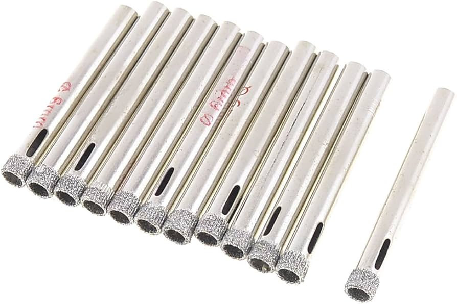

## 设计

搬进来洗衣房只有一个洗手池，水经常从洗衣机和洗手池中间的夹缝里楼下去，缺少置物功能。张工设计了一个台面来解决这个问题，还做了个专业的模型和我解释😁

台面我们决定用bunnings的birch panel来做，尺寸宽度600mm正好满足这块区域。

## 铁角固定

考虑到台面的承重，我选择用角铁固定在瓷砖背后的木桩上。难点在于木桩探测器没法精确透过瓷砖找到木桩，这一步花了我很长时间。我用内窥镜工具从插座处伸到墙背后，找到了一面墙上的木桩。找到木桩后用金刚石钻头在瓷砖上钻孔，固定铁角。

## 台面制作

我们想保留现有的洗手台，讲台面坐在上方，所以用一张复写纸勾勒出水槽的造型，然后在面板上切割出来。我先用钻头沿着红线在木板上开孔，然后用Jigsaw切割。不过因为木板挺硬且厚，切出来边角不是很光滑，用砂纸打磨后看着还可以。这一步之后得研究下怎么更好的切割出弧度。

## 内置式晾衣架

在制作过程中，我们觉得现有的晾衣设施不太完善，经常需要把折叠式衣架放在邻近的活动区域，造成行走不便，所以思考利用洗衣房的现有空间增加一个晾衣功能。网上看到很多在两侧墙壁间固定一根横杆的做法，但个人觉得影响美观。最后在研究之下发现了一个利用台面下方和洗衣机上方之间的空间的内置式晾衣架，完美满足了我们的需求👍🏻

制作起来非常方便，我干脆用台面剩下的边角料做了个框，再买了一根3mm的铝管，根据长度切割好，组装起来就搞定了。

## 组装

## 完工

## 后续

台面改造完成后洗衣房立马感觉干净整洁了，整理衣服的时候也方便了。在有了孩子后，还能尿布台来用，基本每天都会用到，非常实用。

但也有失误的地方：

- 没有用树脂做完成表面，仅仅刷了聚氨酯。这在经常遇到热水的区域就很容易造成木板的开裂。
- 洗手台和木板的接缝处防水做的不好。现有的是一体式洗手台，上表面和木板的贴合度没法像单独的洗手台那样做到百分百贴合，时间久了水会从接缝处渗进去，久而久之造成水龙头附近的木板开裂。

要想解决这个问题，我应该会直接买个新的洗手台，重新做下水管道，虽然会额外花些材料费，但保证了防水的牢靠。
