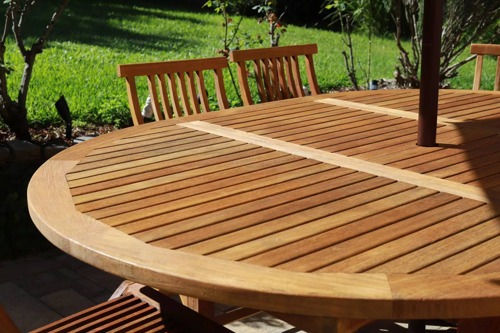

## 户外餐桌翻新

2020年搬家前从Facebook上花了$400买了这套Jeti的餐桌椅，虽然表面有些老化但是结构还很结实。类似的[全新6人桌](https://jati.com.au/product/camden-teak-extension-table/)要价$5000以上，我觉得太超预算了还不保值，翻新一下旧的挺好的。

### 材料 

- Cabot deck cleaner 
- High pressure washer
- Boom
- [Teak sealer](https://www.greencorpmarine.com/product/justteak-teak-sealer-choice-of-2-shades/)
- [Teak brightener](https://www.greencorpmarine.com/product/justteak-teak-brightener-available-in-3-different-sizes/)

### 步骤

1. 用花园水管清洗表面
2. 按1:4的比例稀释decking清洁剂
3. 喷洒在桌子表面，注意夏天的话不要让溶剂晒干了，让溶剂反应个20-30分钟
4. 用高压水枪冲洗表面
5. 我还配合使用了teak增亮剂，有一些作用，如果没有的话可以跳过
6. 重复以上步骤直到表面干净
7. 晾干
8. 用120号砂纸打磨表面
9. 用抹布擦干净表面
10. 上两层木油。取决于喜欢的效果，我使用的是清油，一般bunnings买的decking oil也可以用。大面积使用前先找个角落试试效果，觉得满意了再用。

翻新后的效果还是很棒的

