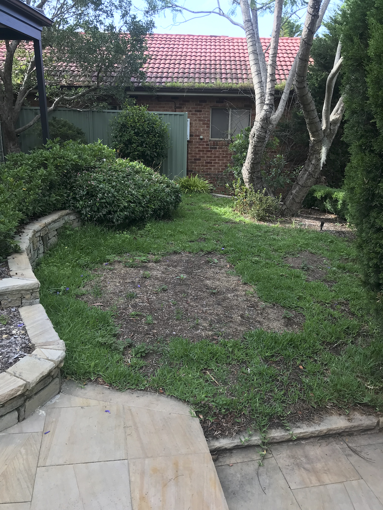
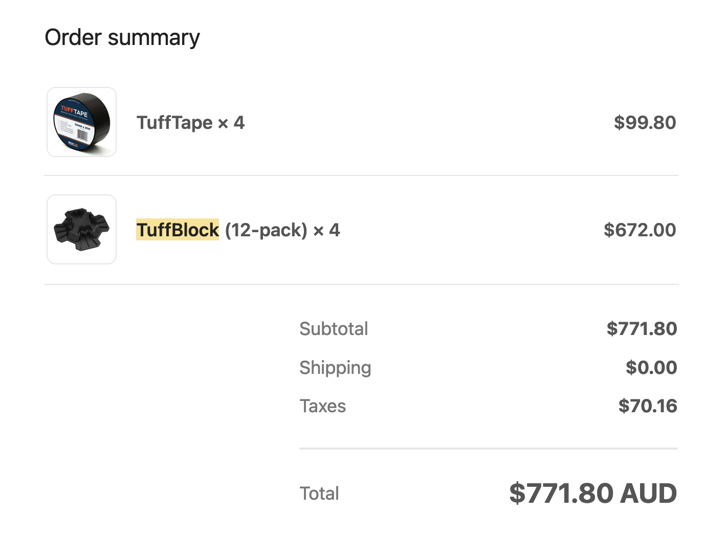

## 设计

原来的前院是一片贫瘠的草地，疏于打理，又因为错误的堆放材料造成草坪中间坏死了一块，使得这块区域使用率很低。

最初考虑重新铺草皮，分析下来发现由于周围的树荫和冬天日照不足，养好这块区域很有难度，所以考虑打造一个露台来改善这块区域。露台也可以作为入户门前的迎宾区域，显得更干净大气。

## 场地准备

开始动工是2023年3月，买了一把夯土的工具平整土地，头脑一热就决定先把草给铲了。不得不说，这活可真累人。带着土的草皮看似不重，等到我塞满了一个绿桶差点都推不动。整理干净草皮，我精确了测量好场地尺寸，在sketchup里面做了个模型看看效果。

设计时候就意识到这个工程有三个难点

- 现有两侧台阶落差有100mm，平台的水平面和两侧的衔接有难度
- 和现有花池弧形区域的收边
- 平台和土层间距很小，地基方案的实施

## 采购

根据模型我预估出材料的数量

- 90*45mm H3 Treated pine 90LM
- Blackbutt 86*19mm 280LM
- 金属连接件

我从[Abbey Timber](https://abbeytimber.com.au/)订购了木材

在研究了几天地基方案后，我衡量了传统挖坑埋桩和新型塑料可调节桩基的优劣。考虑到挖坑大概率会碰到旁边一颗蓝花楹的根系，而且几十个坑很费体力，我觉得用[Tuffblock instant footing](https://www.bunnings.com.au/tuffblock-300-x-300-x-90mm-instant-foundation-system-deck-support_p2410345) 塑料桩基来做地基。材料费上应该比木桩+水泥固定要贵，但从施工上更方便了。

## 项目暂停

从2023年3月份动土开工框架初步定了走向之后就停滞了，2023年7月回国了两个月。9月回悉尼后一直苦恼于框架调节水平的问题，也迟迟没有开工。说实话第一次自己做这么大的项目在一些节点上有些无从下手。从11月份下旬开始继续推进这个项目，进度缓慢，在调节坡度上很花时间而且很难看到显著成果。

## 框架

整个框架沿长边按中线间隔450mm排好框架，用tuffblock调好高度的样子。调节高度还挺花时间的，用到了不少装窗户用的packer微调，**这一步尽管很枯燥花时间，但直接关系到完成面的平整度，所以一定要确保做到位**

在四周的关键点位上我还是用挖坑埋桩的方式固定，确保了整个结构的抗风能力和稳定性。

## 面板铺设

12月中旬做好了框架之后，原本想新年前完工的计划看着是做不到了。所以和客户（张师傅）商量先把1/3的区域做好，让一部分人先享受起来😁

由于要和现有花坛做弧度衔接，每一根面板的角度都是单独测量并切割，很耗时间。我和老戎合作以每五根为一个批次，用木工夹固定，钻孔，固定。

夏天干活的好处是下班了天还亮，抽空固定几根也是进度。

## 圣诞节

圣诞节好兄弟来家里聚餐，也一起参与到了建造中。慢慢推进之中也是享受动手乐趣的过程。
花坛的弧度也非常完美。

## 木料的清洗

我用的是blackbutt，属于本地桉树种类的一科，类似的木头里面含有单宁(tannin)，是天然木料里含有的一种物质。不同的木料的含量不同。blackbutt属于含量比较高的木材。新买的木材安装后在自然环境下风吹雨淋会吸取出单宁，如果遇到石材表面会使得石材染色。传统的做法是安装6个月后再上油，为的是使得木料里的单宁物质完全分泌。

我为了可以再完工后立马上木油保护，就用了[new timber prep](https://www.bunnings.com.au/cabot-s-2l-new-timber-prep-2l_p1520592)来加速单宁的分泌过程。稀释后用工具喷洒在新木料表面，过了几分钟就可以看到深色的类似颜料的物质出现，等过20分钟后用清水洗净。

## 板凳

## 成品

## 回顾

目前为止做的最大的项目，还好没有成为烂尾项目😁
这样规模的项目，仅凭一个人要完成确实很有难度，好在有家里人还有朋友的帮忙👍🏻

回顾下来有有几点技术在之后的项目里可以改进

- 桩基的选择。我发现用塑料可调节桩基好处是省去挖坑灌水泥的时间，但是要做平塑料底座下的接触面，以及用塑料薄片来微调其实也挺花时间的。如果坑位不多的话可能还是直接挖坑埋桩来的直接。

- 场地上材料的存储与管理。中间工期停留的几个月内，应该对材料做好保护工作。