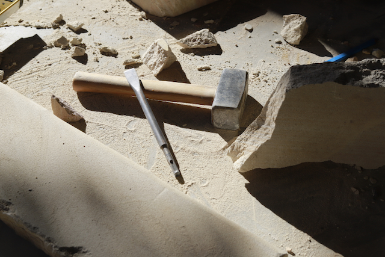

2022年3月恰逢悉尼难得一遇的大雨季节，搬入新家就发现车库地基处有渗水情况。当时初步排查是因为墙外侧的步道地面高过了车库地基，并且因为邻居地势比我家高，下大雨时候会有水流到这根道上，所以土壤经常吸饱了水。自此以后，这条道就不受待见，一来光照不足常有杂草，二来经常潮湿不太干净。

一直没有找到一个解决方法，每逢下大雨就常常担心车库渗水的问题。

2023年3月的时候我找来热水器安装公司把原本的水桶换成了即热式热水器，大大提高了设备的通过性。其中涉及到煤气管道口径的升级。

2023年10月的时候我找来了一位挖掘工人降下100mm的土，运走了3吨的土，将侧道路面和车库地面齐平。过了几个月的时间又变得杂草遍布，下雨天还有一个个的泥坑。

2024年6月的时候老丈人来家里帮忙先把土又降下了100mm，过程中碰到几处沙岩石，费了不少功夫清除。土壤基本是黏土为主，下雨之后非常泥泞。还挖到了自来水管，因为土层降低我们担心之后铺砖和走机械会压坏水管，所以决定请水工来改道至墙上。

之后整理思路把这项目分成了几个分项

- 降土
- 安装挡土墙
- 增加表面排水渠，接入现有雨水系统
- 墙基防水
- 路面铺设
- 景观绿化

## 挡土墙

我和老张在衡量几种方案后决定用铁柱和木头的材料以降低造价。
拉好线，定好高度开始挖坑。坑的深度是350mm，墙高400mm。

## 增设排水渠

排水渠的坡度按1：100施工，这条步道两头已有现有的铺砖路面，11米的长度60mm落差，自然坡度不够。
按比例挖好沟下排水渠。
为了将排水渠连入现有雨水管道，我从Kennards Hire租了一把水泥锯来切割地面，$260一天，Hilti一查还是个高端牌子。租赁公司给了4块电池，每次用两块，接上花园水管就可以切割。
花了一小时不到把地面切开，挖干净pvc管道旁边的土，发现已有的转接头破裂了。跑了两趟bunnings决定直接换个Y形双通接口，也换了个新的雨水管接口。之后花了一天时间接好了雨水渠到双通的管道。

## 路面铺设

期间正好我生日，全家人出去度假玩了四天。
回来开工后准备铺砖的活了，之前大家一直决定铺碎石乱拼(Random Flagging)的式样，根据面积估算需要的沙子和水泥数量。我去bunnings租了一辆皮卡，从家附近的供货商拉回了1吨河沙，十包20kg水泥。第二天和老张从[Simon Seconds](https://www.simonsseconds.com.au/)拉回了11平米的沙岩砖。

万事俱备，就等开工。

老张负责准备砂浆，我负责摆放样式。
第一天挺简单，第二天开始苦恼现有的砖都是方正的做不出随机样式，第三天技术革新学会了用角磨机切割石材，这下可以随心切割出想要的造型。

总共花了一周的时间琢磨样式，细节，全家人都贡献了自己的想法。
看到完工的样子还是很有成就感。

## 景观绿化

网上看到一个设计在篱笆墙上用不锈钢绳和螺丝绕出爬藤架，我决定把现有的绿色篱笆喷成深灰色来凸显之后的绿植。
同时想把这面篱笆墙变成绘画艺术创作的画板，把原本不受喜欢的侧道变成一处可以活动的小空间。

